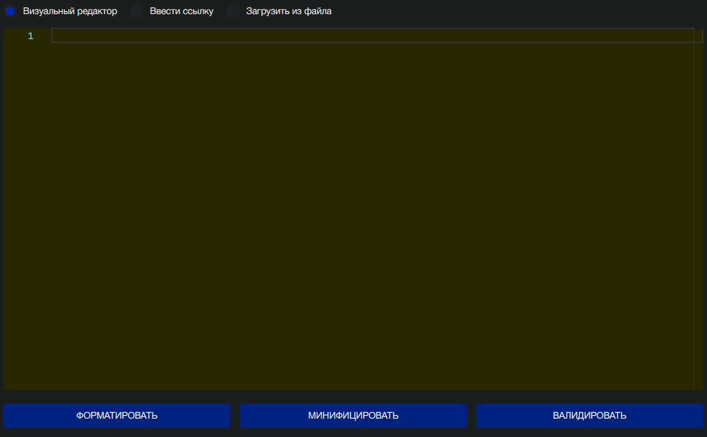
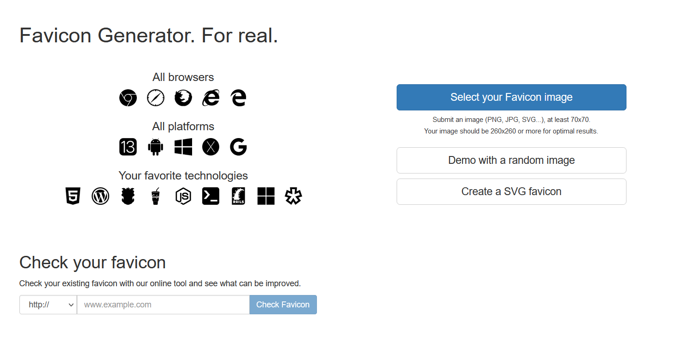
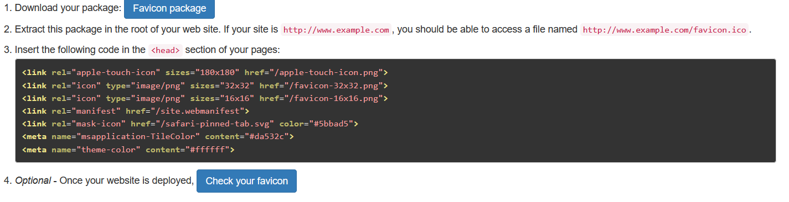

# Minimal personal website

Итак, перейдем к настройке, первым делом вам нужно изменить информацию на вашу, когда вы уже все сменили. Можно приступать к сжатию html-файлов, в этом помогает сервис [Involta](https://involta.ru/tools/validator-html/)

В поле "Визуальный редактор" введите код из html-файла или загрузите файл во вкладке "Загрузка из файла" и нажмите кнопку "Минифицировать"

https://realfavicongenerator.net/ - этот сайт поможет сгенерировать favicon для разных устройств и платформ, вам нужно просто загрузить своё изображение. Нажав на кнопку "Select your Favicon image"

Далле внизу тыкаем на кнопку "Generate your Favicons and HTML code"

Скачиваем "Favicon package"  
И вставляем во все html-файлы в тег head предложенный код.

<code>Про бесплатные хостинги, для начала можно использовать Github Pages или Netlify</code>

Также я оставил шаблон резюме которое вы можете удалить или изменить по себя.
Еще изменить robots.txt и sitemap.xml , вот генераторы - [Robots.txt](https://pr-cy.ru/robots/), [sitemap.xml](https://www.xml-sitemaps.com/)

P.S svg брал тут <a href="https://www.svgrepo.com/">SvgRepo</a>

